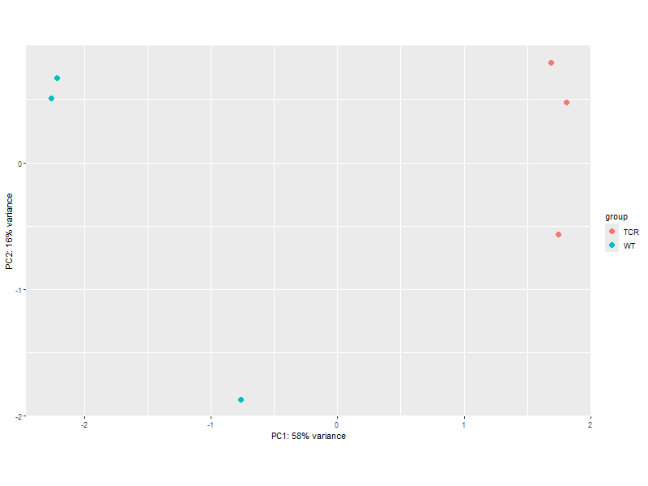
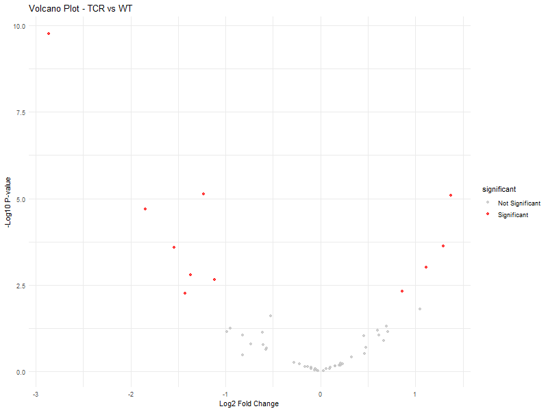
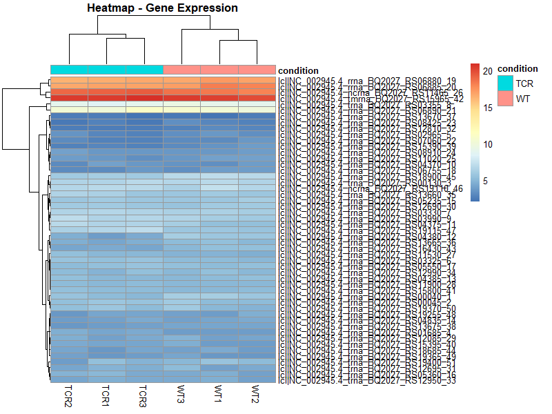
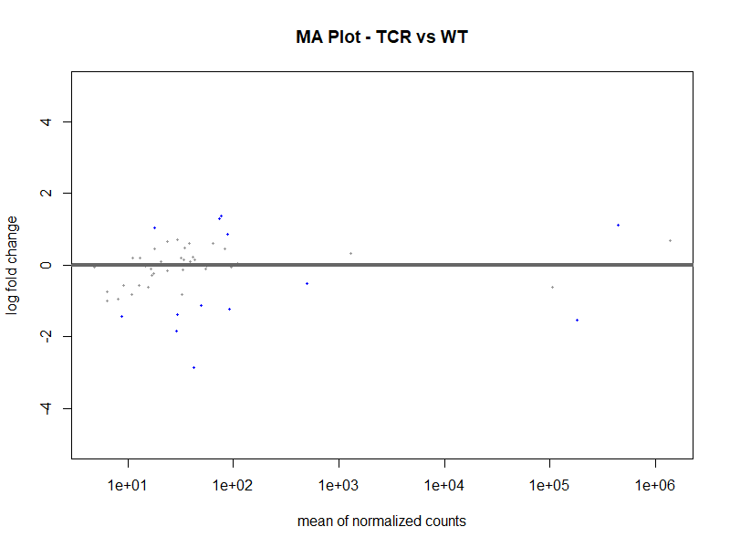

# MTB RNA-seq Differential Expression Analysis Pipeline

## Overview
An end-to-end RNA-seq differential expression analysis pipeline comparing gene expression between **TCR deletion mutant** and **Wild type BCG** strains of *Mycobacterium tuberculosis* variant bovis. This project uses pseudo-alignment based quantification with Kallisto and statistical analysis with DESeq2.

---

## Biological Question
*"Which genes are differentially expressed between TCR deletion mutant vs Wild type BCG in Mycobacterium tuberculosis variant bovis?"*

---

## Organism and Data

| Parameter | Details |
|-----------|---------|
| Organism | *Mycobacterium tuberculosis* variant bovis |
| Reference Genome | GCF_000195835.3 (ASM19583v2) |
| Strain | AF2122/97 |
| Genome Size | ~4.3 Mb |
| Study | TCR deletion mutant vs Wild type BCG |
| Data Source | NCBI SRA — BioProject linked samples |

---

## Sample Information

| Sample | Condition | SRR Accession | Mapping Rate |
|--------|-----------|---------------|-------------|
| WT-1 | Wild type BCG | SRR13627324 | 21.7% |
| WT-2 | Wild type BCG | SRR13627325 | 23.0% |
| WT-3 | Wild type BCG | SRR13627326 | 27.2% |
| TCR-1 | TCR deletion mutant | SRR13627327 | 31.5% |
| TCR-2 | TCR deletion mutant | SRR13627328 | 31.5% |
| TCR-3 | TCR deletion mutant | SRR13627329 | 31.0% |

---

## Tools and Versions

| Tool | Version | Purpose |
|------|---------|---------|
| SRA Toolkit | 3.0.3 | Download raw sequencing data from NCBI SRA |
| FastQC | 0.12.1 | Quality control of raw and trimmed reads |
| fastp | 1.1.0 | Read trimming and quality filtering |
| Kallisto | 0.51.1 | Pseudo-alignment based transcript quantification |
| R | 4.6.0 | Statistical analysis environment |
| tximport | 1.40.0 | Import Kallisto quantification into R |
| DESeq2 | 1.52.0 | Differential expression analysis |
| pheatmap | - | Heatmap visualization |
| ggplot2 | - | Volcano plot visualization |

---

## Pipeline Workflow

```
Raw SRA Data (NCBI)
        ↓
   SRA Toolkit (prefetch + fastq-dump)
        ↓
   FastQC (Quality Control — before and after trimming)
        ↓
   fastp (Read Trimming)
        ↓
   Kallisto index (build once — used for all 6 samples)
        ↓
   Kallisto quant (pseudo-alignment — per sample)
        ↓
   tximport (import counts into R)
        ↓
   DESeq2 (differential expression analysis)
        ↓
   Results + Visualizations
```

---

## Step by Step Commands

### Step 1 — Download SRA Data
```bash
prefetch SRR13627324
fastq-dump --split-files SRR13627324
```

### Step 2 — Quality Control
```bash
fastqc SRR13627324_1.fastq SRR13627324_2.fastq
```

### Step 3 — Read Trimming
```bash
fastp -i SRR13627324_1.fastq -I SRR13627324_2.fastq \
      -o SRR13627324_1_trimmed.fastq -O SRR13627324_2_trimmed.fastq \
      -h SRR13627324_fastp.html -j SRR13627324_fastp.json
```

### Step 4 — Build Kallisto Index (once only)
```bash
kallisto index -i mtb_kallisto_index GCF_000195835.3_ASM19583v2_rna_from_genomic.fna
```

### Step 5 — Kallisto Quantification (repeat for each sample)
```bash
kallisto quant -i mtb_kallisto_index -o WT1_quant \
      SRR13627324_1_trimmed.fastq SRR13627324_2_trimmed.fastq
```

### Step 6 — DESeq2 Analysis in R
```r
library(tximport)
library(DESeq2)

# Set working directory
setwd("path/to/quant/folders")

# Define sample files
files <- c(
  "WT1_quant/abundance.tsv",
  "WT2_quant/abundance.tsv",
  "WT3_quant/abundance.tsv",
  "TCR1_quant/abundance.tsv",
  "TCR2_quant/abundance.tsv",
  "TCR3_quant/abundance.tsv"
)
names(files) <- c("WT1", "WT2", "WT3", "TCR1", "TCR2", "TCR3")

# Import kallisto results
txi <- tximport(files, type = "kallisto", txOut = TRUE)

# Create sample information
samples <- data.frame(
  sample = c("WT1", "WT2", "WT3", "TCR1", "TCR2", "TCR3"),
  condition = c("WT", "WT", "WT", "TCR", "TCR", "TCR")
)
rownames(samples) <- samples$sample

# Create DESeq2 object
dds <- DESeqDataSetFromTximport(txi, colData = samples, design = ~ condition)

# Run DESeq2
dds <- DESeq(dds)

# Get results
res <- results(dds, contrast = c("condition", "TCR", "WT"))
summary(res)

# Save results
res_df <- as.data.frame(res)
write.csv(res_df, "DESeq2_results.csv")
```

---

## Key Results

### Differential Expression Summary

| Parameter | Value |
|-----------|-------|
| Total transcripts analyzed | 51 |
| Upregulated in TCR mutant | 5 (9.8%) |
| Downregulated in TCR mutant | 8 (16%) |
| Total differentially expressed | 13 |
| Adjusted p-value threshold | < 0.1 |

---

## Visualizations

### PCA Plot


The PCA plot shows clear separation between TCR deletion mutant (teal) and Wild type BCG (orange) samples on PC1 (58% variance), confirming distinct gene expression profiles between the two conditions.

---

### Volcano Plot


The volcano plot shows differentially expressed transcripts between TCR mutant and Wild type. Red dots represent statistically significant transcripts (adjusted p-value < 0.05). The most significant transcript shows high fold change with very low p-value.

---

### Heatmap


The heatmap shows expression patterns across all 6 samples. TCR mutant and Wild type samples cluster separately confirming condition-specific expression differences. Orange/red = high expression, Blue = low expression.

---

### MA Plot


The MA plot shows log2 fold change vs mean expression. Blue triangles indicate transcripts with large fold changes. Horizontal line at zero represents no change between conditions.

---

## Notable Technical Challenge

**Salmon installation issue:** Initially attempted to use Salmon for pseudo-alignment but encountered locale errors and RAM constraints (WSL limited to ~2.8GB RAM on 4GB PC). Switched to **Kallisto** which uses less RAM, has no locale dependencies, and produces equivalent results. This demonstrates practical problem-solving in bioinformatics when working with resource-limited environments.

---

## Environment

- **OS:** Windows 11 with WSL (Ubuntu)
- **Conda Environment 1:** trimming_env — fastp, SRA Toolkit
- **Conda Environment 2:** ngs_analysis — Kallisto
- **R Environment:** Windows — R 4.6.0, RStudio - DESeq2, tximport, rtracklayer
- **FastQC:** installed separately on Windows (D drive)

---

## Acknowledgements

- Raw sequencing data obtained from NCBI SRA: SRR13627324 — SRR13627329
- Reference genome obtained from NCBI RefSeq: GCF_000195835.3 — *Mycobacterium tuberculosis* variant bovis AF2122/97
- Reference transcriptome: GCF_000195835.3_ASM19583v2_rna_from_genomic.fna
- All data used is publicly available through NCBI (National Center for Biotechnology Information)

---

## Author
**Manishkumar R**
M.Sc. Biotechnology
Chennai, Tamil Nadu, India
📧 rmanishkumar1702@gmail.com
🔗 GitHub: github.com/rmanishkumar1702-DESK
